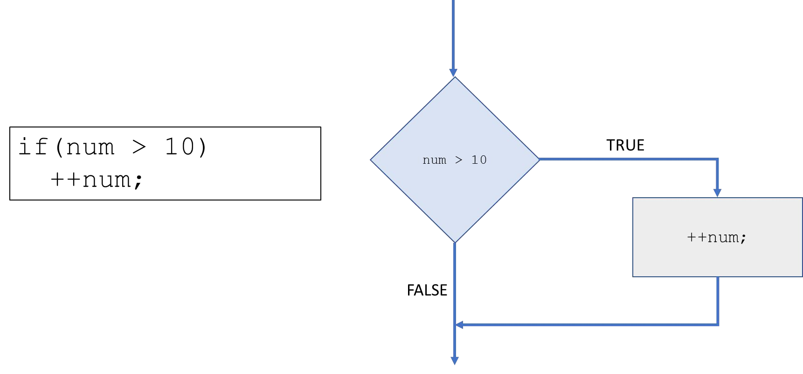
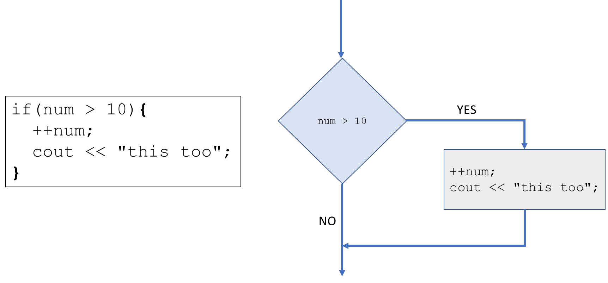
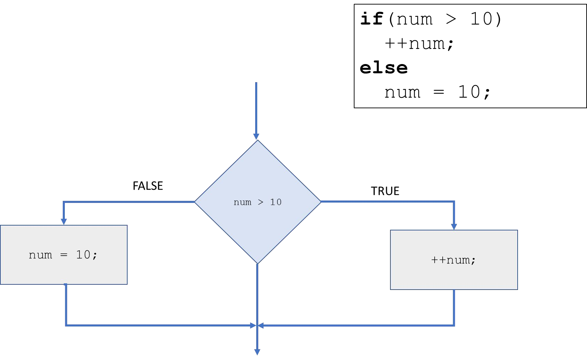
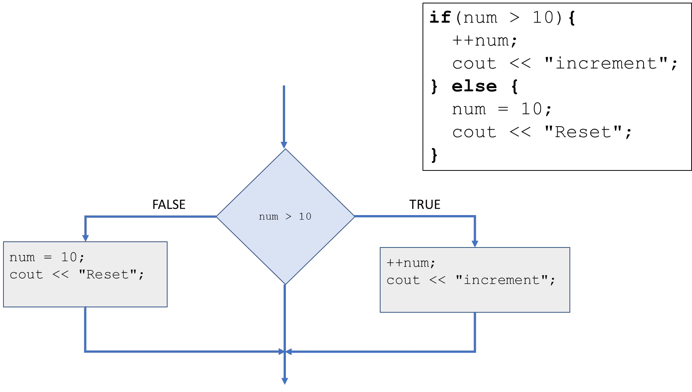

# Cornell Notes

## Topic: If Statement

## Date: 23/04/2026

---

### Cue Column (Questions, Keywords, or Prompts)

- [Insert question or keyword]
- [Insert question or keyword]
- [Insert question or keyword]

---

### Notes Section (Main Notes)

#### `if` Statement

```cpp
if(exp)
    statement;
```
- If the expression is `true` then execute the statement
- If the expression is `false` then skip the statement

 

#### `block` statment
```cpp
if(exp)
{
    statement1;
    statement2;
    statement3;
}
```
 
- Create a block of code by including more than one statement in code block `{ }`
- Blocks can also contain variable declarations
- These variables are visible only within the block – local scope

#### `if-else` statement
```cpp
if(exp)
    statement1;
else
    statement2;
```
- If the expression is `true` then execute statement1
- If the expression is `false` then execute statement2  
- `block` statement:

---

### Summary Section (Summary of Notes)

[Insert a brief summary of the key ideas and takeaways]