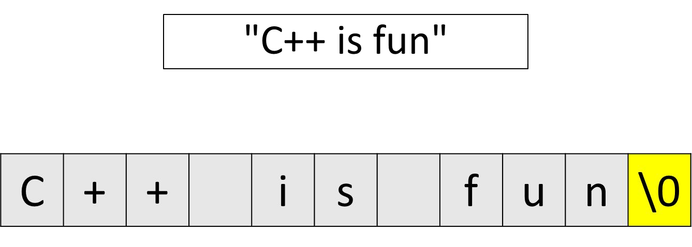
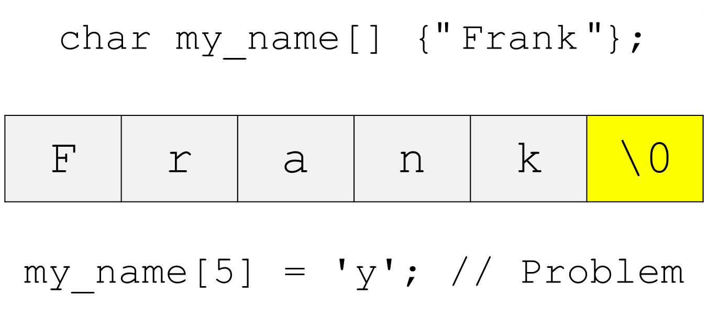
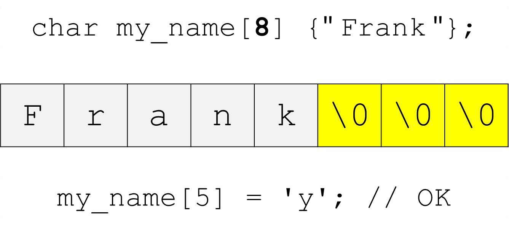
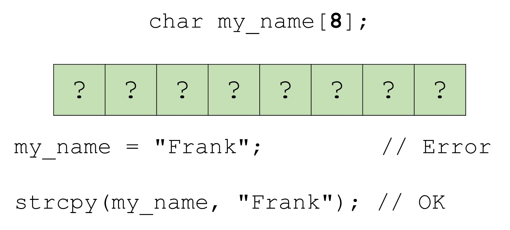

# Cornell Notes

## Topic: C-style Strings

## Date: 04/05/2026

---

### Cue Column (Questions, Keywords, or Prompts)

- [Insert question or keyword]
- [Insert question or keyword]
- [Insert question or keyword]

---

### Notes Section (Main Notes)

#### C-style Strings
- **Sequence of characters**
  - contiguous in memory
  - implemented as an array of characters
  - terminated by a null character (null)
    - null – character with a value of zero
  - Referred to as zero or null terminated strings
- **String literal**
  - sequence of characters in double quotes, e.g. “Frank”
  - constant
  - terminated with null character 

- Declaring variables:
  

#### `#include <cstring>`
- Functions that work with C-style Strings
  - Copying
  - Concatenation
  - Comparison
  - Searching
  - and others
- A few examples:

#### `#include <cstdlib>`
- General purpose functions
  - Includes functions to convert C-style Strings to
    - integer
    - float
    - long
    - etc.

---

### Summary Section (Summary of Notes)

[Insert a brief summary of the key ideas and takeaways]