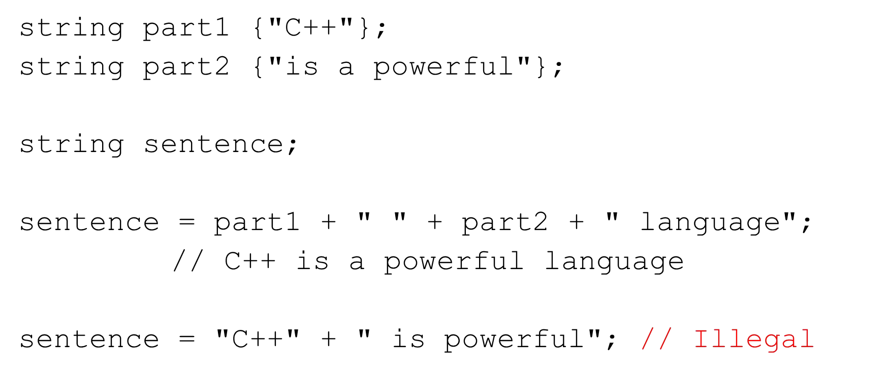

# Cornell Notes

## Topic: C++ Strings

## Date: 04/05/2026

---

### Cue Column (Questions, Keywords, or Prompts)

- [Insert question or keyword]
- [Insert question or keyword]
- [Insert question or keyword]

---

### Notes Section (Main Notes)

#### C++ Strings
- `std::string` is a Class in the Standard Template Library
  - `#include <string>`
  - std namespace
  - contiguous in memory
  - dynamic size
  - work with input and output streams
  - lots of useful member functions
  - our familiar operators can be used (+, = , < , <=, >, >=, +=, ==, !=, []…)
  - can be easily converted to C-style Strings if needed
  - safer
- Declaring and initializing:

- Assignment `=` 
- Concatenation 
- Accessing characters `[]` and `at()` method   
- Comparing `==` `!=` `>` `>=` `<` `<=`
- The objects are compared character by character lexically.
- Can compare:
  - two std::string objects
  - std::string object and C-syle string literal
  - std::string object and C-style string variable 

- Substrings – `substr()`
  - Extracts a substring from a std::string
```cpp
object.substr(start_index, length)
string s1 {"This is a test"};
cout << s1.substr(0,4); // This
cout << s1.substr(5,2); // is
cout << s1.substr(10,4); // test
```
- Searching – `find()`
  - Returns the index of a substring in a std::string 
```cpp
object.find(search_string)
string s1 {"This is a test"};
cout << s1.find("This"); // 0
cout << s1.find("is"); // 2
cout << s1.find("test"); // 10
cout << s1.find('e'); // 11
cout << s1.find("is", 4); // 5
cout << s1.find("XX"); // string::npos
```
- Removing characters – `erase()` and `clear()`
  - Removes a substring of characters from a std::string
  - `erase()` removes a portion of the string based on index and length
  - `clear()` removes all characters from the string
```cpp
object.erase(start_index, length)
string s1 {"This is a test"};
cout << s1.erase(0,5); // is a test
cout << s1.erase(5,4); // is a
s1.clear(); // empties string s1
```
- Other useful methods
```cpp
string s1 {"Frank"};
cout << s1.length() << endl; // 5
s1 += " James";
cout << s1 << endl; // Frank James
```
- Many more…
- Input `>>` and `getline()`
  - Reading std::string from cin
```cpp
string s1;
cin >> s1;
// Hello there
// Only accepts up to the first space
cout << s1 << endl; // Hello
getline(cin, s1); // Read entire line until \n
cout << s1 << endl; // Hello there
getline(cin, s1, 'x'); // this isx
cout << s1 << endl; // this is
```
---

### Summary Section (Summary of Notes)

[Insert a brief summary of the key ideas and takeaways]