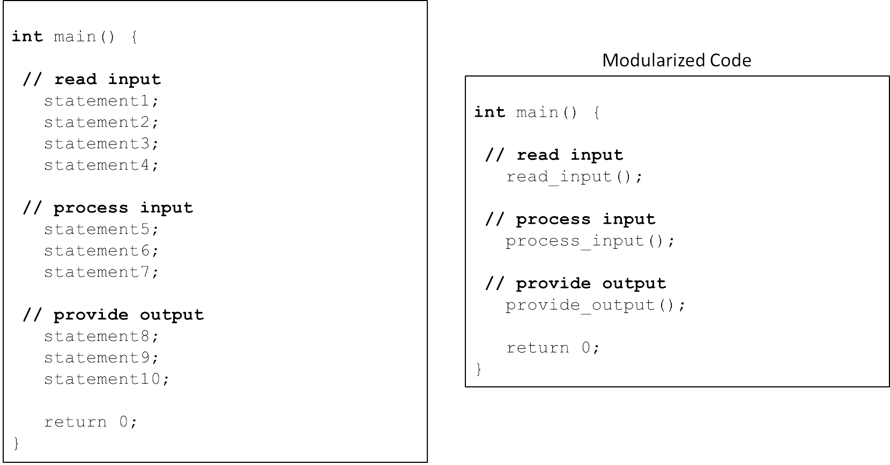
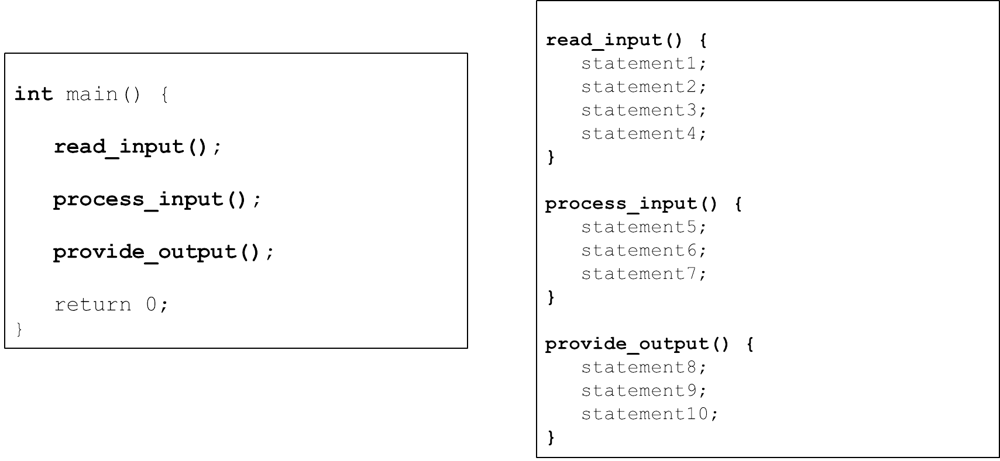
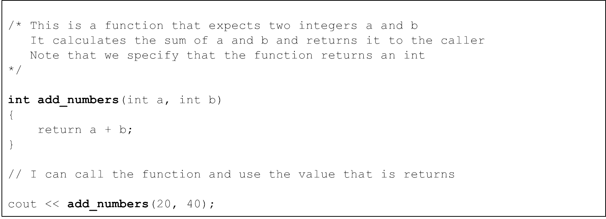
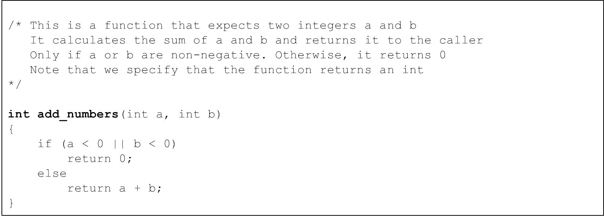

# Cornell Notes

## Topic: What is a Function?

## Date: 04/05/2026

---

### Cue Column (Questions, Keywords, or Prompts)

- [Insert question or keyword]
- [Insert question or keyword]
- [Insert question or keyword]

---

### Notes Section (Main Notes)

#### What is a function?
- C++ programs
  - C++ Standard Libraries (functions and classes)
  - Third-party libraries (functions and classes)
  - Our own functions and classes
- Functions allow the modularization of a program
  - Separate code into logical self-contained units
  - These units can be reused 



- Boss/Worker analogy:
  - Write your code to the function specification
  - Understand what the function does
  - Understand what information the function needs
  - Understand what the function returns
  - Understand any errors the function may produce
  - Understand any performance constraints
  - Don’t worry about HOW the function works internally
    - Unless you are the one writing the function!
- Example `<cmath>`
  - Common mathematical calculations
  - Global functions called as:
```cpp
function_name(argument);
function_name(argument1, argument2, ...);
cout << sqrt(400.0) << endl; // 20.0
double result;
result = pow(2.0, 3.0); // 2.0^3.0
```
- User-defined functions
  - We can define our own functions
  - Here is a preview 
 


- Return zero if any of the arguments are negative




---

### Summary Section (Summary of Notes)

[Insert a brief summary of the key ideas and takeaways]