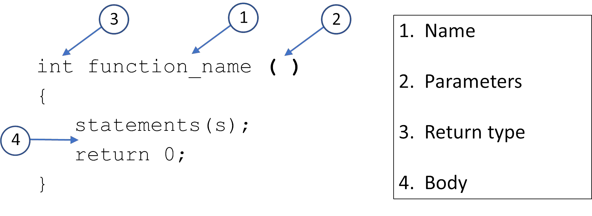
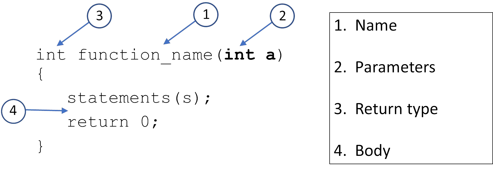
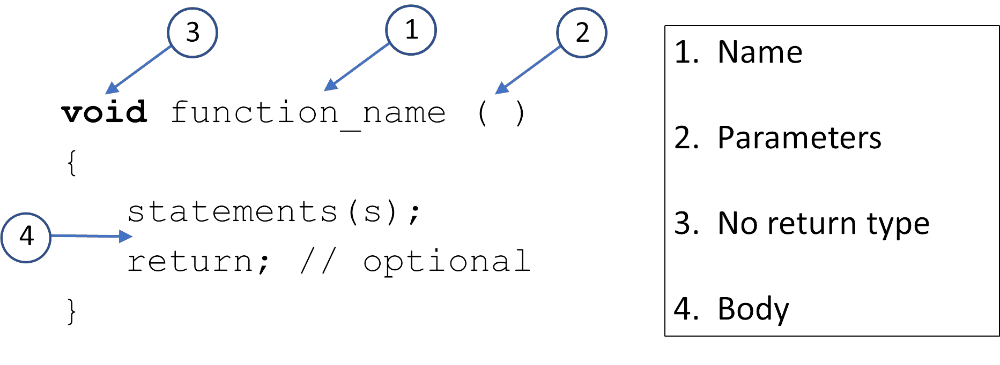

# Cornell Notes

## Topic: Function Definition

## Date: 04/05/2026

---

### Cue Column (Questions, Keywords, or Prompts)

- [Insert question or keyword]
- [Insert question or keyword]
- [Insert question or keyword]

---

### Notes Section (Main Notes)

#### Defining Functions
- name
  - the name of the function
  - same rules as for variables
  - should be meaningful
  - usually a verb or verb phrase
- parameter list
  - the variables passed into the function
  - their types must be specified
- return type
  - the type of the data that is returned from the function
- body
  - the statements that are executed when the function is called
  - in curly braces {}
- Example with no parameters



- Example with 1 parameter



- Example with no return type (void)



- Example with multiple parameters

```cpp
void function_name(int a, std::string b)
{
    statements(s);
    return; // optional
}
```
- A function with no return type and no parameters
```cpp
void say_hello () {
    cout << "Hello" << endl;
}
```

#### Calling a function
```cpp
void say_hello () {
    cout << "Hello" << endl;
}
int main() {
    say_hello();
    return 0;
}
// =============================================== //
void say_hello () {
    cout << "Hello" << endl;
}
int main() {
    for (int i{1} i<=10; ++i)
    say_hello();
    return 0;
}
// =============================================== //
void say_world () {
    cout << " World" << endl;
}
void say_hello () {
    cout << "Hello" << endl;
    say_world();
}
int main() {
    say_hello();
    return 0;
}
// =============================================== //
void say_world () {
    cout << " World" << endl;
    cout << " Bye from say_world" << endl;
}
void say_hello () {
    cout << "Hello" << endl;
    say_world();
    cout << " Bye from say_hello" << endl;
}
int main() {
    say_hello();
    cout << " Bye from main" << endl;
    return 0;
}
```


---

### Summary Section (Summary of Notes)

[Insert a brief summary of the key ideas and takeaways]