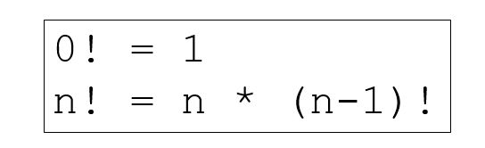
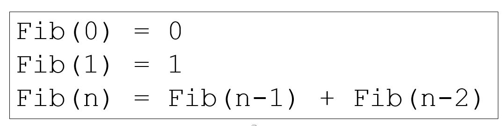

# Cornell Notes

## Topic: Recursive Functions

## Date: 06/05/2026

---

### Cue Column (Questions, Keywords, or Prompts)

- [Insert question or keyword]
- [Insert question or keyword]
- [Insert question or keyword]

---

### Notes Section (Main Notes)

#### Recursive Functions
- A recursive function is a function that calls itself
  - Either directly or indirectly through another function
- Recursive problem solving
  - Base case
  - Divide the rest of problem into subproblem and do recursive call
- There are many problems that lend themselves to recursive solutions
- Mathematic – factorial, Fibonacci, fractals,…
- Searching and sorting – binary search, search trees, …

#### Example - Factorial

- Base case:
  - factorial(0) = 1
- Recursive case:
  - factorial(n) = n * factorial(n-1)

```cpp
unsigned long long factorial(unsigned long long n) {
if (n == 0)
    return 1;
    // base case
    return n * factorial(n-1);
    // recursive case
}
int main() {
    cout << factorial(8) << endl; // 40320
    return 0;
}
```

#### Example - Fibonacci


- **Base case**:
  - Fib(0) = 0
  - Fib(1) = 1
- **Recursive case**:
  - Fib(n) = Fib(n-1) + Fib(n-2)

```cpp
unsigned long long fibonacci(unsigned long long n) {
    if (n <= 1)
    return n;
    // base cases
    return fibonacci(n-1) + fibonacci(n-2); // recursion
}
int main() {
    cout << fibonacci(30) << endl; // 832040
    return 0;
}
```
---

### Summary Section (Summary of Notes)

- Recursive functions call themselves either directly or indirectly.
- They require a base case to terminate the recursion.
- Common examples include factorials, Fibonacci numbers, and certain algorithms like binary search.
