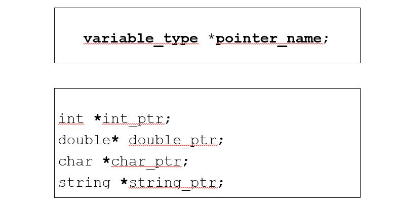
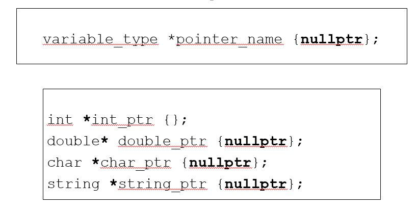

# Cornell Notes

## Topic: Declaring Pointers

## Date: 06/05/2026

---

### Cue Column (Questions, Keywords, or Prompts)

- [Insert question or keyword]
- [Insert question or keyword]
- [Insert question or keyword]

---

### Notes Section (Main Notes)

#### Declaring Pointers

- Initializing pointer variables to `nullptr` (C++11 and later) or `NULL` (pre-C++11) to indicate that they point nowhere

- Always initialize pointers
- Uninitialized pointers contain garbage data and can `point anywhere`
- Initializing to zero or nullptr (C++ 11) represents address zero
  - implies that the pointer is `pointing nowhere`
- If you don’t initialize a pointer to point to a variable or function then you should initialize it to nullptr to `make it null`

---

### Summary Section (Summary of Notes)

[Insert a brief summary of the key ideas and takeaways]