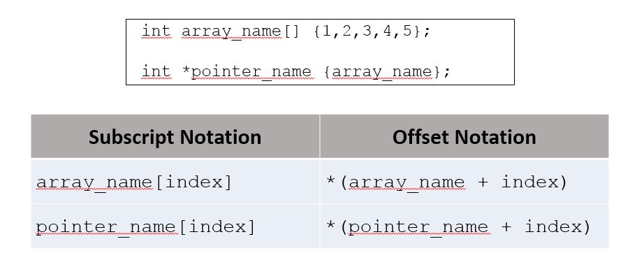

# Cornell Notes

## Topic: The Relationship Between Arrays and Pointers

## Date: 06/05/2026

---

### Cue Column (Questions, Keywords, or Prompts)

- [Insert question or keyword]
- [Insert question or keyword]
- [Insert question or keyword]

---

### Notes Section (Main Notes)

#### Relationship Between Arrays and Pointers
- The value of an array name is the address of the first element in the array
- The value of a pointer variable is an address
- If the pointer points to the same data type as the array element then the pointer and array name can be used interchangeably (almost)
```cpp
int scores[] {100, 95, 89};
cout << scores << endl; // 0x61fec8
cout << *scores << endl; // 100
int *score_ptr {scores};
cout << score_ptr << endl; // 0x61fec8
cout << *score_ptr << endl; // 100
// === //
int scores[] {100, 95, 89};
int *score_ptr {scores};
cout << score_ptr[0] << endl;// 100
cout << score_ptr[1] << endl;// 95
cout << score_ptr[2] << endl;// 89
```
#### Using pointers in expressions
```cpp
int scores[] {100, 95, 89};
int *score_ptr {scores};
cout << score_ptr << endl; // 0x61ff10
cout << (score_ptr + 1) << endl; // 0x61ff14
cout << (score_ptr + 2) << endl; // 0x61ff18
// === //
int scores[] {100, 95, 89};
int *score_ptr {scores};
cout << *score_ptr << endl; // 100
cout << *(score_ptr + 1) << endl; // 95
cout << *(score_ptr + 2) << endl; // 89
```

#### Subscript and Offset notation equivalence


---

### Summary Section (Summary of Notes)

[Insert a brief summary of the key ideas and takeaways]