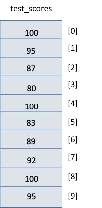

# Cornell Notes

## Topic: What is Arrays?

## Date: 

---

### Cue Column (Questions, Keywords, or Prompts)

- [Insert question or keyword]
- [Insert question or keyword]
- [Insert question or keyword]

---

### Notes Section (Main Notes)

#### 1. Arrays
##### Why do we need arrays?
- Bad scenario without arrays
```cpp
int test_score_1 {0};
int test_score_2 {0};
int test_score_3 {0};
int test_score_4 {0};
int test_score_5 {0};
...
int test_score_100 {0};
```
- **Characteristics**:
  - Fixed size
  - Elements are all the same type
  - Stored contiguously in memory
  - Individual elements can be accessed by
  - their position or index
  - First element is at index 0
  - Last element is at index size-1

  - No checking to see if you are out of bounds

  - Always initialize arrays
  - Very efficient
  - Iteration (looping) is often used to process



---

### Summary Section (Summary of Notes)

[Insert a brief summary of the key ideas and takeaways]