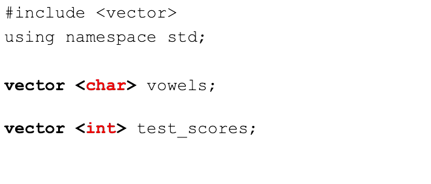

# Cornell Notes

## Topic: What is Arrays?

## Date: 

---

### Cue Column (Questions, Keywords, or Prompts)

- [Insert question or keyword]
- [Insert question or keyword]
- [Insert question or keyword]

---

### Notes Section (Main Notes)

#### 1. Arrays
##### Why do we need arrays?
- Bad scenario without arrays
```cpp
int test_score_1 {0};
int test_score_2 {0};
int test_score_3 {0};
int test_score_4 {0};
int test_score_5 {0};
...
int test_score_100 {0};
```
- **Characteristics**:
  - Fixed size
  - Elements are all the same type
  - Stored contiguously in memory
  - Individual elements can be accessed by
  - their position or index
  - First element is at index 0
  - Last element is at index size-1

  - No checking to see if you are out of bounds

  - Always initialize arrays
  - Very efficient
  - Iteration (looping) is often used to process


#### 2. Vectors
- Suppose we want to store test scores for my school
- I have no way of knowing how many students will register next year
- Options:
  - Pick a size that you are not likely to exceed and use static arrays
  - Use a dynamic array such as vector
#### What is a vector?
- Container in the C++ Standard Template Library
- An array that can grow and shrink in size at execution time
- Provides similar semantics and syntax as arrays
- Very efficient
- Can provide bounds checking
- Can use lots of cool functions like sort, reverse, find, and more.
#### Declaring
 

#### Initializing


#### Characteristics
- Dynamic size
- Elements are all the same type
- Stored contiguously in memory
- Individual elements can be accessed by
- their position or index
- First element is at index 0
- Last element is at index size-1
- `[ ]` - no checking to see if you are out of bounds
- Provides many useful function that do bounds check
- Elements initialized to zero
- Very efficient
- Iteration (looping) is often used to process

#### Accessing vector elements – array syntax


---

### Summary Section (Summary of Notes)

[Insert a brief summary of the key ideas and takeaways]