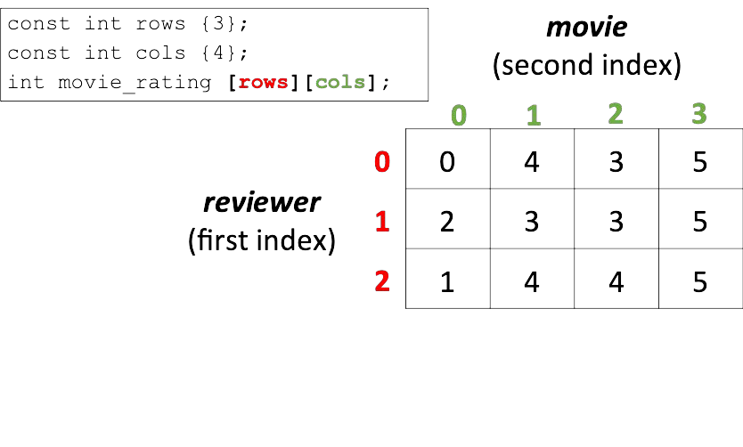
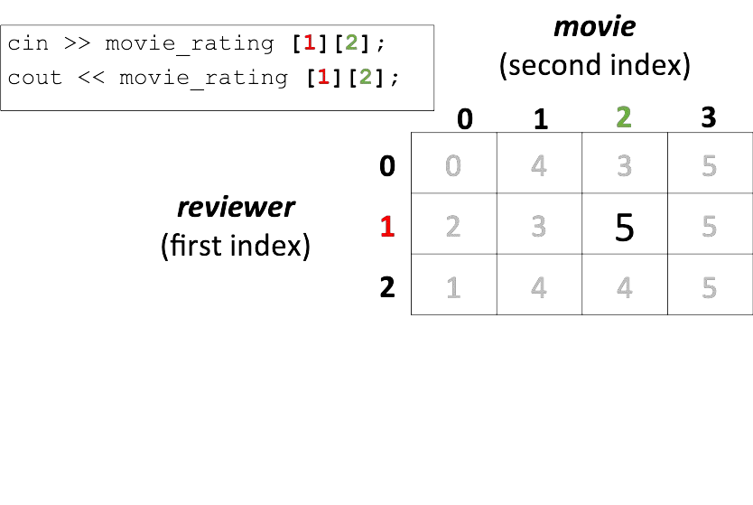

# Cornell Notes

## Topic: Multidimensional Arrays

## Date: 15/04/2026

---

### Cue Column (Questions, Keywords, or Prompts)

- [Insert question or keyword]
- [Insert question or keyword]
- [Insert question or keyword]

---

### Notes Section (Main Notes)

#### 1. Multi-dimensional arrays 

#### 2. Accessing array elements in multi-dimensional arrays 

#### 3. Initializing multi-dimensional arrays 

---

### Summary Section (Summary of Notes)

[Insert a brief summary of the key ideas and takeaways]