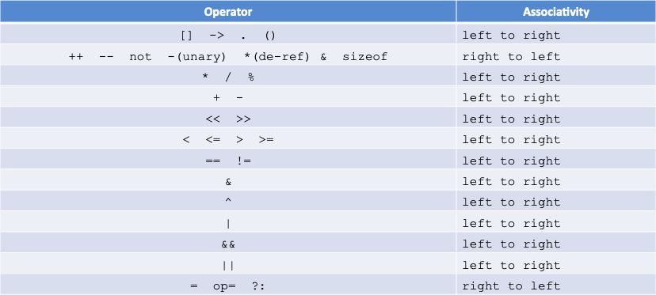

# Cornell Notes

## Topic: Operator Precedence

## Date: 21/04/2026

---

### Cue Column (Questions, Keywords, or Prompts)

- [Insert question or keyword]
- [Insert question or keyword]
- [Insert question or keyword]

---

### Notes Section (Main Notes)

#### Operator Precedence (not a complete list)
Higher to lower



#### What is associativity?
- Use precedence rules when adjacent operators are different 
```cpp
expr1 op1 expr2 op2 expr3 // precedence
```
- Use associativity rules when adjacent operators have the same precedence 
```cpp
expr1 op1 expr2 op1 expr3 // associativity
```
- Use parenthesis to absolutely remove any doubt

#### Example


---

### Summary Section (Summary of Notes)

[Insert a brief summary of the key ideas and takeaways]