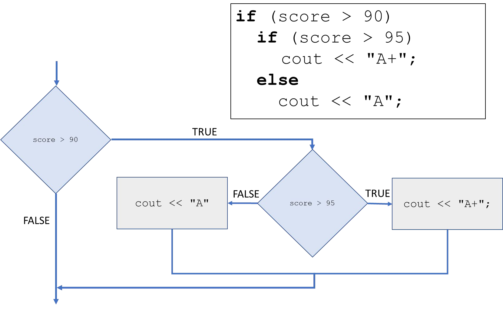

# Cornell Notes

## Topic: Nested If Statement

## Date: 01/05/2026

---

### Cue Column (Questions, Keywords, or Prompts)

- [Insert question or keyword]
- [Insert question or keyword]
- [Insert question or keyword]

---

### Notes Section (Main Notes)

#### Nested if statement

- if statement is nested within another
- Allows testing of multiple conditions
- else belongs to the closest if

---

### Summary Section (Summary of Notes)

[Insert a brief summary of the key ideas and takeaways]