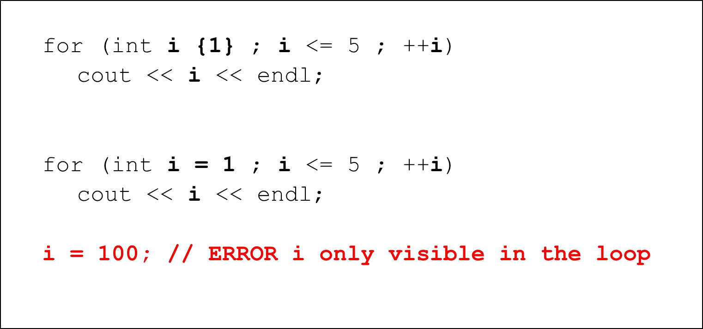

# Cornell Notes

## Topic: For Loop

## Date: 03/05/2026

---

### Cue Column (Questions, Keywords, or Prompts)

- [Insert question or keyword]
- [Insert question or keyword]
- [Insert question or keyword]

---

### Notes Section (Main Notes)

#### `For` Loop
  

- display even numbers: 
- array example: 
- comma operator: 
- The basic for loop is very clear and concise
- Since the for loop’s expressions are all optional, it is possible to have
  - no initialization
  - no test
  - no increment 

---

### Summary Section (Summary of Notes)

[Insert a brief summary of the key ideas and takeaways]